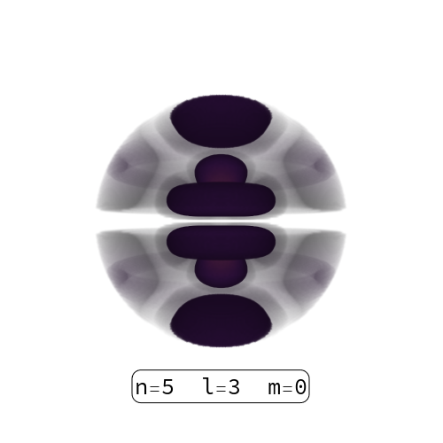
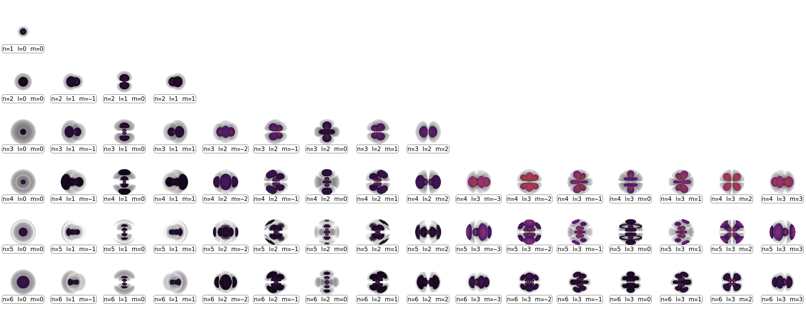

# A Mathematica package for calculating properties of the Hydorgen atom
## Included calculations
* hydrogenAtom.wl -- a mathematica package containing all of the functions to be used in calculations
* hydrogenOrbitals.m -- a short notebook demonstrating how hydrogenAtom.wl can be used to create plots and animations of hydrogen orbitals
* hydrogenOscillators.wl -- a short notebook demonstrating how hydrogenAtom.wl can be used to calculate [oscilator strengths](https://physics.nist.gov/cgi-bin/ASD/lines1.pl?spectra=H&limits_type=0&low_w=&upp_w=&unit=1&de=0&format=0&line_out=0&en_unit=1&output=0&bibrefs=1&page_size=15&order_out=0&max_low_enrg=0&show_av=2&max_upp_enrg=&tsb_value=0&min_str=&A_out=0&f_out=on&intens_out=on&max_str=&allowed_out=1&forbid_out=1&min_accur=&min_intens=&conf_out=on&term_out=on&enrg_out=on&J_out=on&submit=Retrieve+Data)

# hydrogenOrbitals
* A short program demonstrating how hydrogenAtom.wl can be used to create plots of atomic orbitals.
* Has the option of creating a single atomic orbial, a table of all atomic orbitals (up to n=6, l=3, m=+-3 by default), and an animated gif of atomic orbitals (up to n=6, l=3, m=+-3 by default) rotating around the z axis.

## Instructions
### Running code will create plots to be saved in the same directory as the directory which this script is saved
* saveTableAnimation, saveSingleTable, and saveSingleOrbital are bools allowing user to select which type of file to save
* fastPlot is a bool allowing user to run low resolution code for testing or higher resolution for final plots.
* Currently code is very memory intensive adjusting pp variable will lower resolution as well as lowring run time and memory used.

## Example outputs
* A plot of a single orbital n=5, l=3, m=0, rotated pi/4 about the z axis run at pp=100 (changing the filename within the code from foo.png to foo.pdf will increase the resolution as well as the file size)

* A table of orbitals up to n=6, l=3, m=+-3 taken at pp=100  (changing the filename within the code from foo.png to foo.pdf will increase the resolution as well as the file size)

* An animated gif for a table orbitals up to n=6, l=3, m=+-3 taken at pp=50 rotating the camera view abour the z axis.

## External References
* [Orbital Table](https://en.wikipedia.org/wiki/Atomic_orbital#Orbitals_table)

## Potential Improvements
* I have a package in the works which will be a more general independent package which will be useful for making similar plots for all wavefunctions, but some of it is based on unpublished work.
* Adjusting the radius under region function so that it doesn't cut of density plots for high n and l.

* There are several places to improve current code involving memory usage and efficiency
- By adding more read/writes animation can be made to be higher resolution while using less memory. Writing files to hard drive and later uploading when creating gif is probably more efficient.

* Adjusting the opacity may make plots more clear.

# hydrogenAtom
* A short program demonstrating how hydrogenAtom.wl can be used to calculate energy levels and oscillator strengths
* Shows accuracy by comparing results to best data collected by [NIST](https://physics.nist.gov/cgi-bin/ASD/lines1.pl?spectra=H&limits_type=0&low_w=&upp_w=&unit=1&de=0&format=0&line_out=0&en_unit=1&output=0&bibrefs=1&page_size=15&order_out=0&max_low_enrg=0&show_av=2&max_upp_enrg=&tsb_value=0&min_str=&A_out=0&f_out=on&intens_out=on&max_str=&allowed_out=1&forbid_out=1&min_accur=&min_intens=&conf_out=on&term_out=on&enrg_out=on&J_out=on&submit=Retrieve+Data)

## Instructions
### Running code will create plots to be saved in the same directory as the directory which this script is saved
* Adjusting `numb` variable at the beginning of the script will adjust the total number of oscillator strengths to calculate. Currently maximum in this script is 40, just because that is the highest number of oscillators collected by NIST.
* Running script will save tables with energy levels and oscillator strengths to the directoy which contains this script.

## Example outputs
* A calculated table of `numb` number of oscillator strengths and a comparison to [NIST](https://physics.nist.gov/cgi-bin/ASD/lines1.pl?spectra=H&limits_type=0&low_w=&upp_w=&unit=1&de=0&format=0&line_out=0&en_unit=1&output=0&bibrefs=1&page_size=15&order_out=0&max_low_enrg=0&show_av=2&max_upp_enrg=&tsb_value=0&min_str=&A_out=0&f_out=on&intens_out=on&max_str=&allowed_out=1&forbid_out=1&min_accur=&min_intens=&conf_out=on&term_out=on&enrg_out=on&J_out=on&submit=Retrieve+Data) which does not include degeneracy splitting due to relativistic corrections

* A calculated table of all of the relativistic oscillator strengths collected by [NIST](https://physics.nist.gov/cgi-bin/ASD/lines1.pl?spectra=H&limits_type=0&low_w=&upp_w=&unit=1&de=0&format=0&line_out=0&en_unit=1&output=0&bibrefs=1&page_size=15&order_out=0&max_low_enrg=0&show_av=2&max_upp_enrg=&tsb_value=0&min_str=&A_out=0&f_out=on&intens_out=on&max_str=&allowed_out=1&forbid_out=1&min_accur=&min_intens=&conf_out=on&term_out=on&enrg_out=on&J_out=on&submit=Retrieve+Data)
 
 
## External References
* [Hydrogen Wavefunction](https://arxiv.org/pdf/physics/9812032.pdf)
* [Oscilator Strengths](https://zenodo.org/record/1232309/files/article.pdf)
 
## Potential Improvements
* This program would obviously be more helpfull run as a script from the command line, allowing `numb` to be entered by the user. In its current form it requires a front-end, but having the data export to a .csv or .dat file would be more helpfull and remove the need for a front-end.

